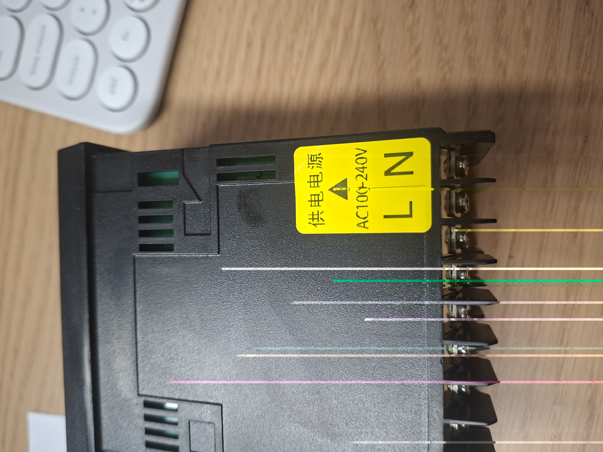
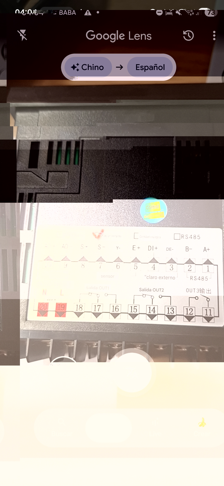
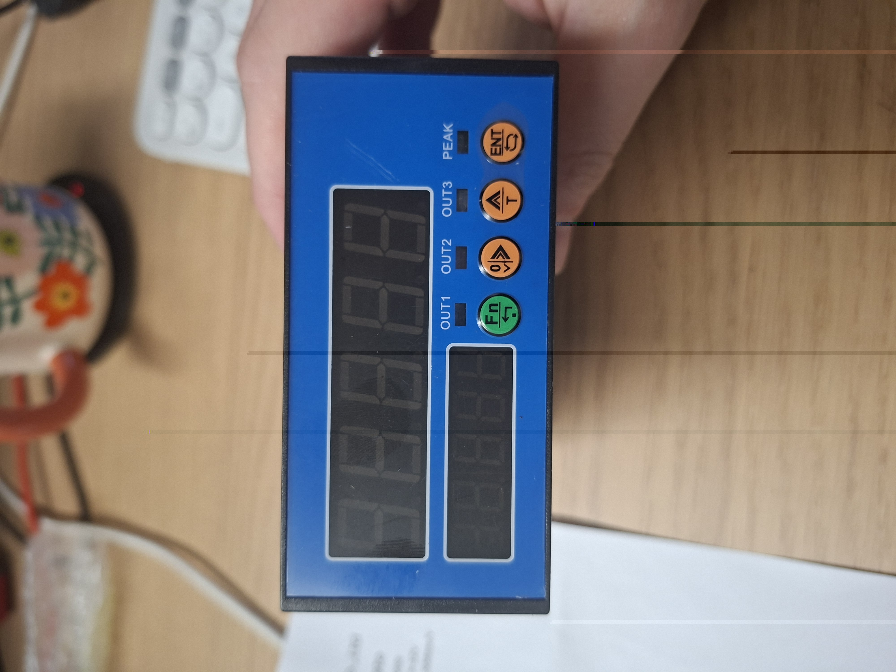
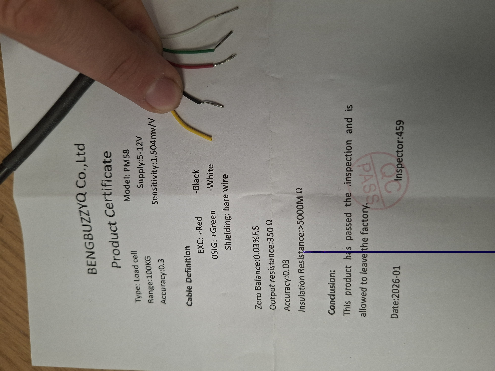
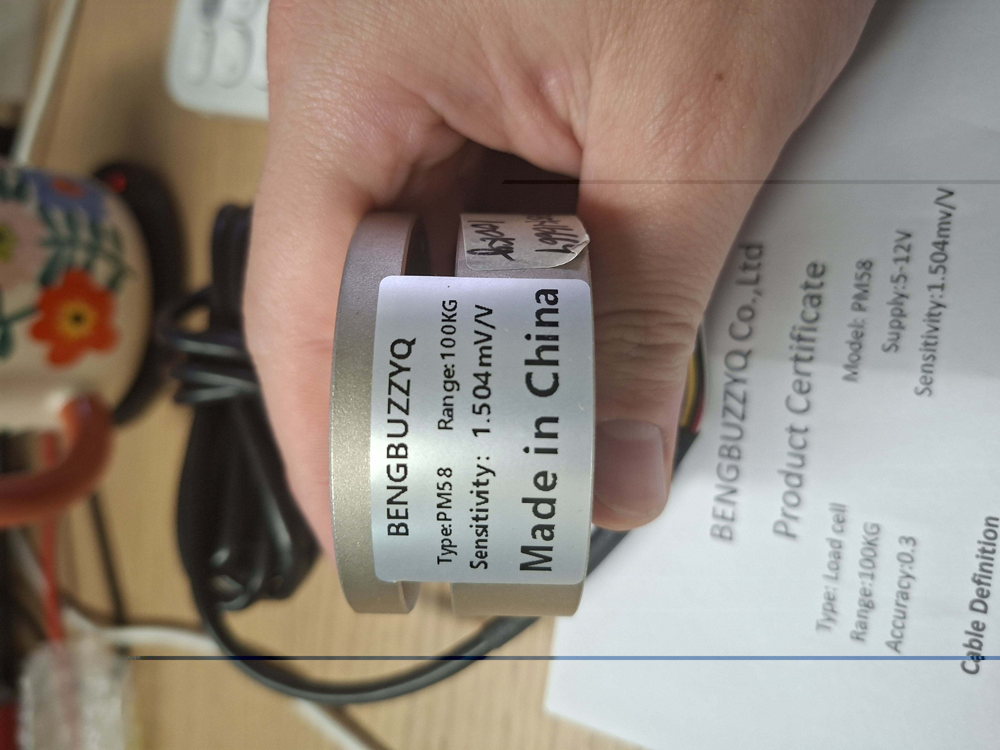

# PM58 Load Cell + High-Speed Acquisition Instrument
## Practical Wiring and Bring-Up Manual

## Summary

This guide explains how to:

1. **Power the acquisition board safely** using the AC mains input shown on your unit.
2. **Wire the PM58 load cell** to the board using the sensor terminals identified on the rear label.
3. **Connect the board to a host PC** using the board's **RS485** interface, which is the most direct digital path visible from the attached photos and the translated manual.

### What is known from your unit

- Your acquisition board appears to be the **full-feature model**. The rear label has the **full-function checkbox marked**, and the terminal map shows:
  - **RS485** on terminals **1 (A+)** and **2 (B-)**
  - **External DI / zero input** on terminals **3 (DI-)** and **4 (DI+)**
  - **Load cell sensor input** on terminals **5 (E+)**, **6 (E-)**, **7 (S-)**, **8 (S+)**
  - **Analog output** on terminals **9 (AO-)** and **10 (AO+)**
  - **AC power input** on terminals **19 (L)** and **20 (N)**
- The translated manual states the instrument supports **AC85–265 V** or **DC10–28 V** depending on the version, and that the sensor interface is **S+/S-/E+/E-**. Your specific unit is clearly labeled **AC100–240 V**, so this guide assumes the **AC-powered version**.
- Your PM58 load cell certificate / label indicates:
  - Model: **PM58**
  - Range: **100 kg**
  - Sensitivity: **~1.504 mV/V**
  - Wire colors: **EXC+ red, EXC- black, SIG+ green, SIG- white**, plus a fifth conductor identified on the certificate as **shield / drain**.

## Epistemic status

**Known**
- Terminal functions above are directly supported by the translated manual and your photos.
- RS485 is the cleanest host-PC interface visible on this board.
- The board front panel and menus support communication and calibration settings.

**Could require verification on your exact hardware**
- The **fifth load-cell conductor**: the certificate says **shield / bare wire**, but your photo shows a **yellow insulated lead** instead of a bare drain. Treat that fifth conductor as the **shield/drain lead unless continuity testing proves otherwise**.
- Some RS485 adapters label lines as **A/B**, others as **D+/D-**. If communication fails, you may need to **swap A and B once**.

**Cannot be confirmed from the attached material alone**
- Whether your PC-side acquisition should be **Modbus polling**, **active RS485 streaming**, or **analog capture via external DAQ** depends on your software architecture.

---

## Materials required

### Core hardware

- **1 × PM58 load cell** (100 kg in your example)
- **1 × high-speed acquisition instrument / data acquisition board**
- **1 × host PC**

### For power: board ↔ mains

- **AC mains source, 100–240 VAC, 50/60 Hz**
- **2-conductor mains cable** rated for your local mains voltage
- **Insulated crimp ferrules** or properly prepared wire ends for the screw terminals
- **Small flat screwdriver** for terminal screws
- Recommended for bench setup:
  - inline fuse or fused power strip
  - power switch or easily accessible disconnect
  - insulated bench environment

### For sensor: PM58 ↔ board

- The PM58's built-in cable / flying leads
- Small ferrules or tinned ends suitable for the board terminals
- Heat-shrink or electrical tape for insulating any unused shield/drain conductor
- **Multimeter** for continuity / wiring verification

### For host PC: board ↔ PC

#### Recommended digital path
- **USB-to-RS485 adapter**
- **Twisted pair cable** or short 2-wire connection from board RS485 terminals to adapter

#### Optional analog path
- **USB DAQ / USB ADC / data acquisition interface** with voltage or current input
- Wiring from **AO+ / AO-** to the external USB DAQ

> Direct connection from this board to a PC over plain USB is **not shown anywhere in the attached photos or manual**. For a normal PC workflow, use **USB-RS485** or an **external USB DAQ**.

---

## Image reference key

Use these image references while following the steps.

- **Fig. 1 — Rear terminal map / full-feature selection**: [rear-terminal-map_full-feature-selection.jpg](assets/rear-terminal-map_full-feature-selection.jpg)
- **Fig. 2 — AC input sticker close-up**: [ac-input-sticker_close-up.jpg](assets/ac-input-sticker_close-up.jpg)
- **Fig. 3 — Front panel / buttons / indicators**: [front-panel_buttons_indicators.jpg](assets/front-panel_buttons_indicators.jpg)
- **Fig. 4 — PM58 load cell label**: [pm58-load-cell_label.jpg](assets/pm58-load-cell_label.jpg)
- **Fig. 5 — PM58 certificate + wire colors**: [pm58-certificate_wire-colors.jpg](assets/pm58-certificate_wire-colors.jpg)
- **Fig. 6 — Google Lens translated rear label**: [rear-label_google-lens-translation.jpg](assets/rear-label_google-lens-translation.jpg)
- **Fig. 7 — Original certificate photo**: [original-certificate_photo.jpg](assets/pm58-certificate_wire-colors.jpg)

---

# Section 1 — Power: board power input (`power-data_acq`)

## Objective

Safely apply power to the acquisition board using the **AC input terminals 19 and 20** identified on the rear label.

## Terminal mapping used in this section

From **Fig. 1** and **Fig. 2**:

- **Terminal 19 = L (Line / Live)**
- **Terminal 20 = N (Neutral)**
- Board label: **AC100–240V**

## Step-by-step

### Step 1 — Confirm you are using the AC-powered board

Reference: **Fig. 2**

- Inspect the yellow sticker on the side of the unit.
- Confirm it explicitly says:
  - **AC100–240V**
  - **L**
  - **N**
- This confirms your specific unit is the **AC-input version**.

**Do not** power this specific unit from low-voltage DC unless you have separate evidence that your exact hardware revision supports that wiring path.

### Step 2 — Locate the mains terminals on the rear label

Reference: **Fig. 1** and **Fig. 6**

- On the terminal map, identify the two red-marked terminals at the lower side of the diagram.
- Confirm:
  - **19 → L**
  - **20 → N**

### Step 3 — Prepare the mains cable

Reference: **Fig. 2**

- Use a **2-conductor AC mains cable** rated for local mains voltage.
- Strip only the minimum needed insulation.
- Prefer **ferrules** on the cable ends before inserting them into the screw terminals.
- Keep the conductors short, mechanically secure, and insulated from neighboring terminals.

### Step 4 — Connect live and neutral

Reference: **Fig. 1** and **Fig. 2**

- Connect the **Live / Line** conductor to **terminal 19 (L)**.
- Connect the **Neutral** conductor to **terminal 20 (N)**.
- Tighten both screw terminals firmly.
- Perform a gentle pull test to confirm the wires are clamped correctly.

### Step 5 — Keep power disconnected while wiring the rest of the system

Reference: **Fig. 1**

- After installing the mains cable, **do not energize the board yet**.
- Complete the **sensor wiring** first.
- Complete the **host-PC link** next.
- Only then apply AC power.

### Step 6 — First power-on check

Reference: **Fig. 3**

- After all other wiring is complete, energize the board.
- Watch the front display.
- The manual indicates that on startup the unit may briefly show the initialization state **`PoiNt`** before normal acquisition begins.
- If the display powers on normally, the power stage is likely correct.

### Step 7 — If the board does not power up

Reference: **Fig. 2** and **Fig. 3**

Check the following in order:

1. Is mains present at the source?
2. Is **L really on terminal 19**?
3. Is **N really on terminal 20**?
4. Are the terminal screws tight?
5. Is the cable or fuse open?
6. Is the power strip / bench switch actually on?

## Safety notes for this section

- This is **mains-voltage wiring**.
- Do not move wires while powered.
- Do not open the enclosure while powered.
- Perform bench bring-up in a controlled environment.
- If this will become a permanent installation, use a proper panel / cabinet build with local electrical protection practices.

---

# Section 2 — Sensor wiring: PM58 load cell to acquisition board (`data_acq-sensor`)

## Objective

Connect the PM58 load cell to the board's four sensor terminals so the board can excite the bridge and read the differential signal.

## Terminal mapping used in this section

From **Fig. 1** / **Fig. 6** and the translated manual:

- **5 = E+** (excitation +)
- **6 = E-** (excitation -)
- **7 = S-** (signal -)
- **8 = S+** (signal +)

## PM58 wire mapping used in this section

From **Fig. 4**, **Fig. 5**, and **Fig. 7**:

- **Red = EXC+ = E+**
- **Black = EXC- = E-**
- **Green = SIG+ = S+**
- **White = SIG- = S-**
- **Fifth conductor = shield/drain**
  - certificate says **shield / bare wire**
  - your photo suggests it may be a **yellow insulated wire** on this unit

## Recommended mapping table

| PM58 wire           | Sensor function |          Board terminal | Label on board                               |
| ------------------- | --------------: | ----------------------: | -------------------------------------------- |
| Red                 |    Excitation + |                       5 | E+                                           |
| Black               |    Excitation - |                       6 | E-                                           |
| White               |        Signal - |                       7 | S-                                           |
| Green               |        Signal + |                       8 | S+                                           |
| Yellow / bare drain |          Shield | Do **not** place on 5–8 | Isolate unless separately grounded by design |

## Step-by-step

### Step 1 — Identify the four active bridge wires

Reference: **Fig. 5** and **Fig. 4**

- Lay out the PM58 wires so the colors are clearly visible.
- Identify the four core bridge connections:
  - red
  - black
  - green
  - white
- Identify the fifth conductor separately.

### Step 2 — Treat the fifth conductor as shield/drain, not as a signal line

Reference: **Fig. 5**

- The certificate describes the fifth lead as **shielding / bare wire**.
- In your photo, that fifth lead looks **yellow-insulated** instead of bare.
- Initial bring-up recommendation:
  - **do not connect that fifth conductor to terminals 5–8**
  - insulate it individually with heat-shrink or tape

If later you observe noise issues, you can evaluate a **single-point shield termination** strategy, but do not guess during first bring-up.

### Step 3 — Locate the sensor terminals on the board

Reference: **Fig. 1** and **Fig. 6**

- On the rear label, find the sensor block identified as:
  - **8 = S+**
  - **7 = S-**
  - **6 = E-**
  - **5 = E+**
- Note that the sensor block is grouped together between the DI terminals and the analog output terminals.

### Step 4 — Connect excitation leads

Reference: **Fig. 1**, **Fig. 4**, **Fig. 5**

- Connect **red** to **terminal 5 (E+)**.
- Connect **black** to **terminal 6 (E-)**.

These two wires power the bridge from the board's excitation source.

### Step 5 — Connect signal leads

Reference: **Fig. 1**, **Fig. 4**, **Fig. 5**

- Connect **white** to **terminal 7 (S-)**.
- Connect **green** to **terminal 8 (S+)**.

These two wires carry the differential measurement signal from the load cell into the acquisition board.

### Step 6 — Verify the wiring before power-on

Reference: **Fig. 1** and **Fig. 5**

Check all of the following:

1. Red is on **E+ / terminal 5**
2. Black is on **E- / terminal 6**
3. White is on **S- / terminal 7**
4. Green is on **S+ / terminal 8**
5. The shield/drain lead is **insulated and not touching anything**
6. No wire whiskers can short adjacent terminals

### Step 7 — Power on and confirm the sensor is alive

Reference: **Fig. 3**

- Apply power to the board.
- Observe the front display.
- With the sensor connected and unloaded, the reading should settle near some small value.
- Apply a small manual force to the sensor.
- The displayed reading should change consistently.

If the sign is reversed, you usually do **not** need to swap E+ / E-. In practice, a reversed sign is more often corrected by calibration or by swapping **S+ / S-** if needed.

### Step 8 — Perform zero and calibration after wiring

Reference: **Fig. 3** and translated manual menu descriptions

After confirming the wiring is alive:

- Use the front buttons to enter the configuration / calibration workflow.
- The translated manual identifies:
  - **C2.CAL** for calibration parameters
  - **200.ZE** for zero calibration
  - **201.Mo** for calibration mode
  - **202.WE** for weight value
- For first bring-up, perform at minimum:
  1. zero with no load applied
  2. one known-weight calibration using a stable test mass

## Troubleshooting for this section

### Symptom: display does not react when load changes

Possible causes:

- wrong wire landed on 5–8
- loose terminal screw
- sensor cable damaged
- shield wire accidentally landed on signal terminal

### Symptom: reading changes in the wrong direction

Possible causes / actions:

- calibration sign issue
- S+ and S- swapped

### Symptom: very noisy reading

Possible causes / actions:

- poor cable routing near mains wiring
- floating / badly handled shield
- weak terminal clamping
- mechanical instability in the fixture

---

# Section 3 — Host-PC connection (`data_acq-host_pc`)

## Objective

Connect the acquisition board to the host PC so measurements can be read digitally.

## Recommended path

Use **RS485 → USB adapter → PC**.

Why this is recommended:

- The board rear label explicitly shows **RS485 terminals**.
- The translated manual includes a dedicated **C5.CoM** communication menu and a **Modbus-RTU register table**.
- No direct USB device interface is visible in the board photos.

## RS485 terminal mapping used in this section

From **Fig. 1** / **Fig. 6**:

- **1 = A+**
- **2 = B-**

## Communication defaults from the translated manual

The translated manual indicates these default communication settings:

- **Address**: 1
- **Baud rate**: default shown as **3**, corresponding to **9600**
- **Check bit / parity**: **none**
- **Stop bit**: **1**
- **Active sending mode**: **off** by default

That implies the safest first PC-side assumption is:

- **Modbus RTU**
- **9600 baud**
- **8 data bits**
- **no parity**
- **1 stop bit**
- **slave address 1**

## Step-by-step — digital RS485 path

### Step 1 — Get a USB-to-RS485 adapter

Reference: **Fig. 1**

Use an adapter that exposes at least:

- **A / B**, or
- **D+ / D-**

### Step 2 — Wire the board to the adapter

Reference: **Fig. 1** and **Fig. 6**

Connect:

- **Board terminal 1 (A+)** → **adapter A / D+**
- **Board terminal 2 (B-)** → **adapter B / D-**

Keep this cable short for first bring-up.

### Step 3 — Plug the adapter into the PC

- Insert the USB-RS485 adapter into the host PC.
- Confirm the OS enumerates a serial device.
  - Linux example: `/dev/ttyUSB0` or `/dev/ttyACM0`
  - Windows example: `COM3`, `COM4`, etc.

### Step 4 — Configure the board communication settings if needed

Reference: **Fig. 3** and translated manual `C5.CoM`

If you are not sure the settings are still at default, use the front panel to inspect:

- **500.Ar** → device address
- **501.br** → baud rate
- **502.Vb** → parity / check bit
- **503.so** → stop bit
- **504.AS** → active sending mode

For initial PC testing, use:

- address = **1**
- baud = **9600**
- parity = **none**
- stop bits = **1**
- active send = **off**

### Step 5 — Read the board from the host PC

There are two practical modes.

#### Mode A — Modbus RTU polling (recommended first)

With **active sending mode off**, poll the board as a Modbus slave.

Useful starting registers from the translated register table:

- **40001 / 40002** → total weight (32-bit)
- **40003 / 40004** → net weight (32-bit)
- **40005 / 40006** → peak value (32-bit)
- **40009** → decimal point
- **40010** → unit
- **40011** → state

#### Mode B — Active sending mode

- If you later enable **504.AS**, the device can actively send data.
- Use this only after the basic Modbus path is confirmed.

### Step 6 — Verify communication

Expected signs of success:

- the PC sees the USB-RS485 adapter
- Modbus reads return valid values instead of timeouts / CRC failures
- the measurement changes when you load the sensor

### Step 7 — If communication fails

Work through these checks in order:

1. Confirm the board is powered and the display is alive.
2. Confirm you used **terminal 1 = A+** and **terminal 2 = B-**.
3. Confirm PC serial settings match the board settings.
4. Confirm the slave address is correct.
5. If still failing, **swap A and B once** and retry.
6. Retry with a very low baud rate only if you suspect noise / wiring issues.

---

## Optional alternative — analog connection to the host PC

## When to use it

Use this path only if you want the board to behave as a **signal conditioner / transmitter** and your PC-side acquisition is a **USB DAQ**, not RS485.

## Relevant terminals

From **Fig. 1** / **Fig. 6**:

- **9 = AO-**
- **10 = AO+**

## Important limitation

A PC cannot normally ingest **AO+ / AO-** directly. You need an intermediate device such as:

- USB DAQ with voltage input
- USB DAQ with current input
- industrial analog input module

## Basic steps

1. Wire **AO+ / AO-** from the board to the external USB DAQ.
2. Configure the board analog output settings under **C6.aNa**.
3. Match the board output mode to the DAQ input type:
   - voltage mode for a voltage-input DAQ
   - current mode for a current-input DAQ
4. Scale the measurement on the PC side according to the configured full-scale mapping.

This analog path is valid, but for a single board-to-PC engineering workflow, **RS485 is usually the cleaner first choice**.

---

# Quick bring-up checklist

## Before power-on

- [ ] AC cable installed to **19 = L** and **20 = N**
- [ ] PM58 wired to **5 = E+**, **6 = E-**, **7 = S-**, **8 = S+**
- [ ] fifth conductor insulated and isolated
- [ ] RS485 wired to **1 = A+**, **2 = B-** if using PC digital link
- [ ] no loose copper strands
- [ ] screw terminals tightened

## After power-on

- [ ] front panel display turns on
- [ ] sensor reading responds to applied force
- [ ] zero / calibration accessible from front panel
- [ ] PC detects USB-RS485 adapter
- [ ] Modbus or serial communication succeeds

---

# Minimal recommended workflow

1. **Wire the PM58 to terminals 5–8**.
2. **Wire AC mains to terminals 19–20**.
3. **Wire RS485 terminals 1–2 to a USB-RS485 adapter**.
4. Power on the board.
5. Confirm the display is alive.
6. Confirm the load cell reading moves.
7. Zero and calibrate.
8. Read the data from the PC over RS485.

---

# Notes specific to your attached hardware

- The board photos strongly suggest you have the **full-feature model**, not the basic-only version.
- The PM58 certificate and the physical PM58 label are consistent on model and range.
- The only notable ambiguity is the **fifth wire color** on the sensor cable. For first bring-up, keep it isolated and focus on the four bridge wires.

