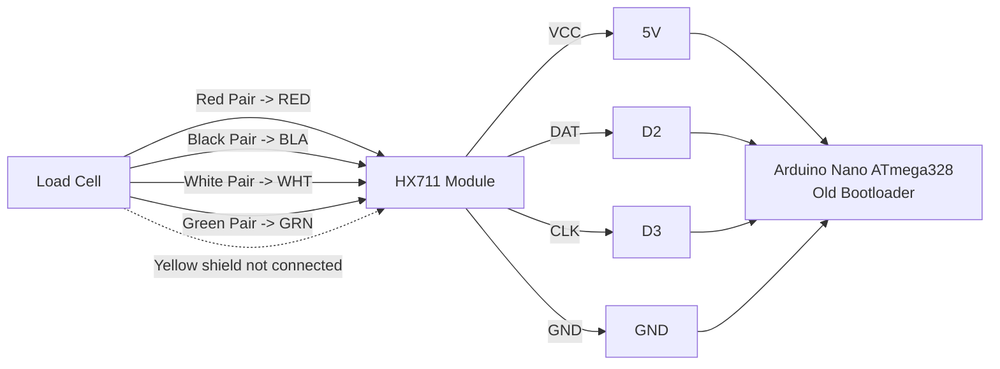
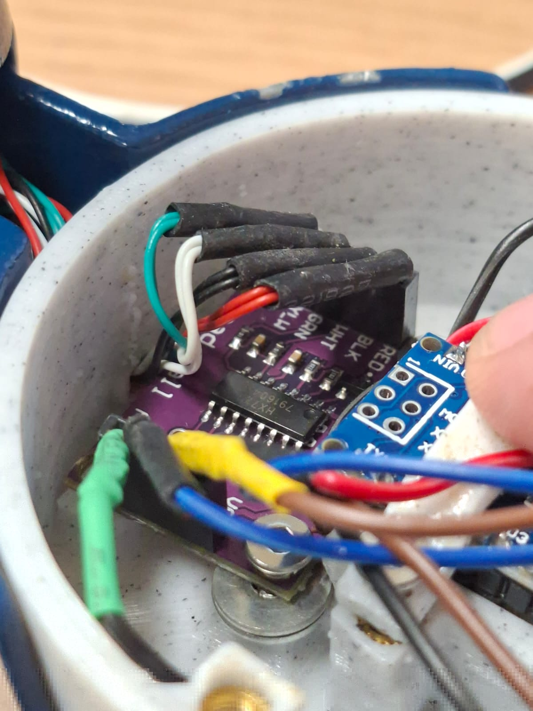
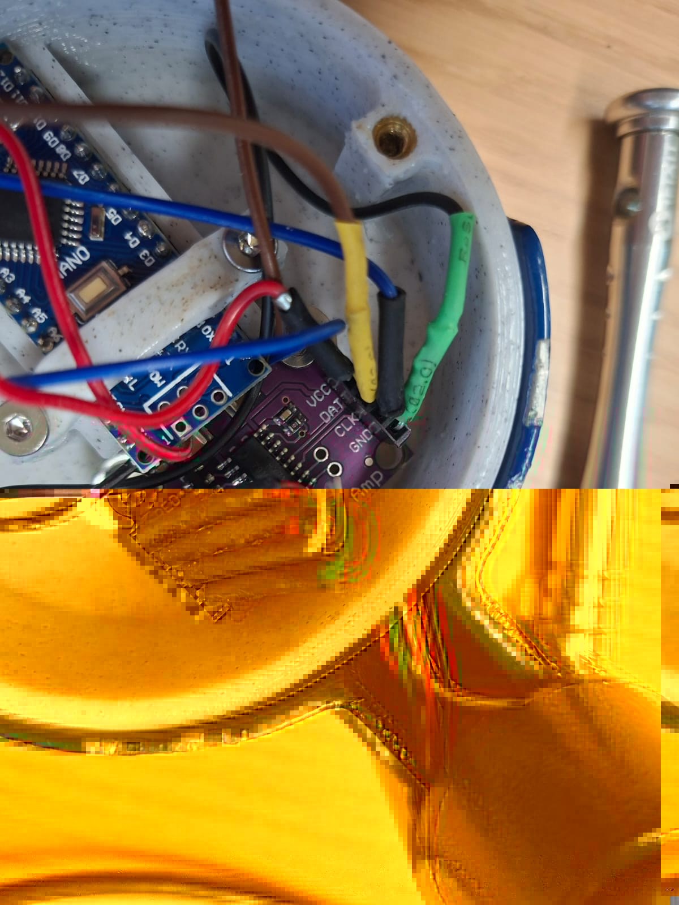
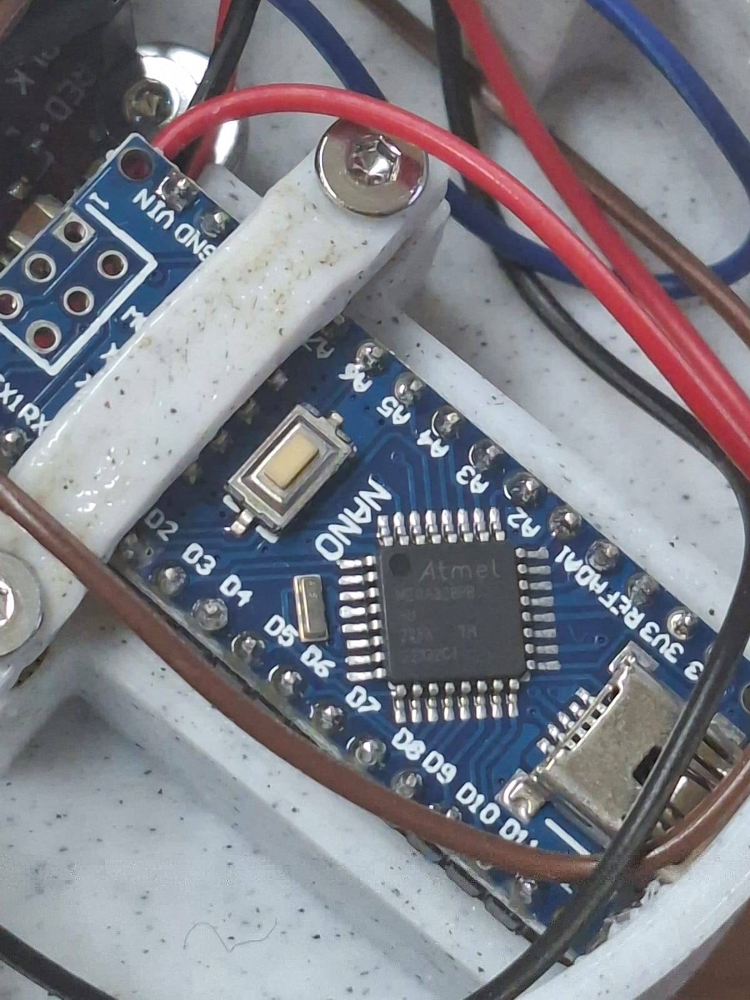
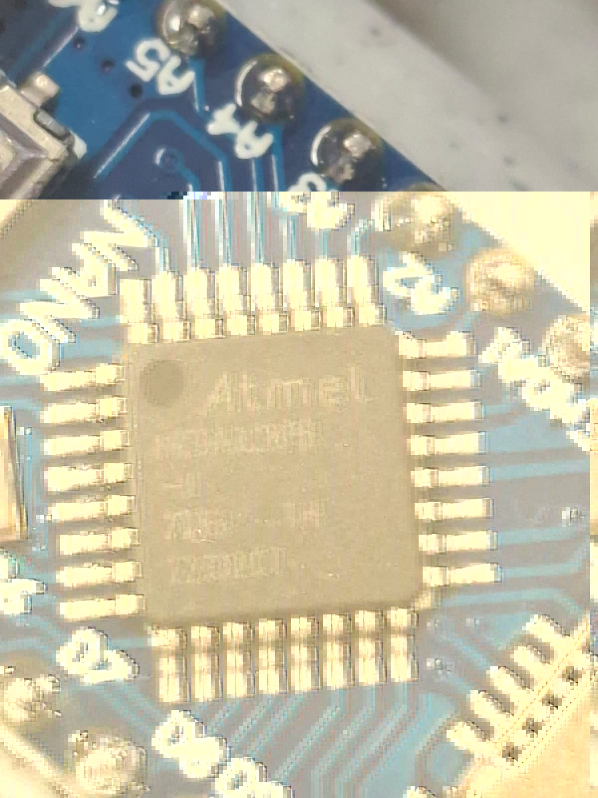

# Handgrip Firmware

This firmware targets an Arduino Nano ATmega328 connected to an HX711 load-cell amplifier. The project is built with PlatformIO and uses the Arduino framework, Rob Tillaart's HX711 library, and TimerOne for deterministic sampling.

The firmware sources live in `Handgrip_Firmware/Core/`:

- `Handgrip_Firmware/Core/Src/main.cpp` configures the HX711 on `D2` and `D3`, samples at `80 Hz`, and streams values over serial.
- `Handgrip_Firmware/Core/Inc/config.h` contains the compile-time settings for calibration and sampling.
- `Handgrip_Firmware/Core/Inc/fifo_buffer.h` provides the FIFO used to decouple interrupt-driven acquisition from serial transmission.

## Prerequisites

Install the required VS Code extension:

1. Install Visual Studio Code.
2. Open the Extensions view.
3. Install the official `PlatformIO IDE` extension published by `PlatformIO`.

You do not need to install PlatformIO Core separately when using the VS Code extension.

## Open And Configure The Project In VS Code

Open the repository root in VS Code, not only `Handgrip_Firmware/`. PlatformIO reads the project configuration from the root [platformio.ini](platformio.ini).

The current project environment is:

- Environment: `nanoatmega328`
- Platform: `atmelavr`
- Framework: `arduino`
- Board: `Arduino Nano ATmega328`

Important: this project uses the Arduino Nano variant with the **old bootloader**. In PlatformIO, keep the board as `nanoatmega328`. Do not switch to the board labeled `Arduino Nano ATmega328 (New Bootloader)`.

The most relevant configuration points are:

- [platformio.ini](platformio.ini): PlatformIO environment, dependencies, upload port, monitor port, monitor speed.
- [Handgrip_Firmware/Core/Inc/config.h](Handgrip_Firmware/Core/Inc/config.h): `SAMPLING_PERIOD_US`, `CALIBRATE_SCALE_MODE`, `SCALE_FACTOR`, `SCALE_OFFSET`.
- [Handgrip_Firmware/Core/Src/main.cpp](Handgrip_Firmware/Core/Src/main.cpp): HX711 pin assignment and the serial output format.

Default runtime settings from the current code:

- HX711 `DAT` pin on Arduino `D2`
- HX711 `CLK` pin on Arduino `D3`
- Serial baud rate `115200`
- Sampling period `12500 us` (`80 Hz`)

## Firmware Workflow

### 1. Review Calibration Settings

Before building, open [Handgrip_Firmware/Core/Inc/config.h](Handgrip_Firmware/Core/Inc/config.h) and confirm:

- `CALIBRATE_SCALE_MODE`
  - `1U`: calibration mode
  - `0U`: normal application mode
- `SCALE_FACTOR`
- `SCALE_OFFSET`
- `SAMPLING_PERIOD_US`

If you are calibrating the device, set `CALIBRATE_SCALE_MODE` to `1U`, upload, collect the calibration result, then update `SCALE_FACTOR` and `SCALE_OFFSET` and switch back to `0U`.

### 2. Confirm The PlatformIO Environment

Open [platformio.ini](platformio.ini) and verify that the environment is still:

```ini
[env:nanoatmega328]
platform = atmelavr
board = nanoatmega328
framework = arduino
```

The project already declares these dependencies:

- `robtillaart/HX711@^0.6.3`
- `paulstoffregen/TimerOne@^1.2`

PlatformIO installs them automatically during the first build.

### 3. Build The Project

You can build from the VS Code UI in either of these ways:

1. Click the `Build` checkmark in the PlatformIO toolbar.
2. Open the PlatformIO side panel and run `Project Tasks > nanoatmega328 > General > Build`.

PlatformIO shortcut:

- `Ctrl+Alt+B`: build

Command-line alternative from the repository root:

```bash
pio run -e nanoatmega328
```

### 4. Connect The Arduino Nano

Connect the Arduino Nano by USB. This project is configured for Linux-style serial device names:

- `upload_port = /dev/ttyUSB*`
- `monitor_port = /dev/ttyUSB*`

If your adapter enumerates differently, update [platformio.ini](platformio.ini) to the correct port such as `/dev/ttyUSB0` or `/dev/ttyACM0`.

### 5. Upload The Firmware

Upload from VS Code in either of these ways:

1. Click the `Upload` right-arrow icon in the PlatformIO toolbar.
2. Open the PlatformIO side panel and run `Project Tasks > nanoatmega328 > General > Upload`.

PlatformIO shortcut:

- `Ctrl+Alt+U`: upload

Command-line alternative:

```bash
pio run -e nanoatmega328 -t upload
```

If upload fails immediately, re-check that the connected board is the old-bootloader Arduino Nano and not the `New Bootloader` variant.

### 6. Open The Serial Monitor (optional if not using LSL_Bridge & LSL_Viewer)

The firmware emits serial frames at `115200` baud with this format:

```text
D,<seq>,<timestamp_us>,<value_gr>
```

Open the serial monitor from VS Code:

1. Click the plug icon in the PlatformIO toolbar.
2. Or run `Project Tasks > nanoatmega328 > Monitor > Monitor`.

PlatformIO shortcut:

- `Ctrl+Alt+S`: serial monitor

Command-line alternative:

```bash
pio device monitor -b 115200
```

If the firmware is running correctly, you should see lines like:

```text
D,42,1234567,315.25
```

## Hardware Connections

The current hardware topology from the project notes is:

- Arduino Nano with old bootloader
- HX711 load-cell amplifier
- Load-cell wires connected to the HX711 module

### Wiring Diagram



### Connection Table

#### HX711 Module To Arduino Nano

| HX711 pin | Cable color | Arduino Nano pin |
| --- | --- | --- |
| VCC | Rojo | 5V |
| DAT | Cafe | D2 |
| CLK | Azul | D3 |
| GND | Negro | GND |

#### Load Cell To HX711 Module

| Load-cell wire | Meaning | HX711 terminal |
| --- | --- | --- |
| Red pair | VCC | RED |
| Black pair | GND | BLA |
| White pair | Signal + | WHT |
| Green pair | Signal - | GRN |
| Yellow | Shield against EMI | Not connected |

## Reference Photos

Sensor to HX711 module:



HX711 module to Arduino Nano:



ADC module part number:


MCU reference photo 1:



MCU reference photo 2:



## Expected Build And Runtime Result

After the environment is configured correctly:

1. PlatformIO resolves the `HX711` and `TimerOne` dependencies.
2. The project builds for `env:nanoatmega328`.
3. The firmware uploads to the Arduino Nano over USB.
4. The serial monitor shows `D,<seq>,<timestamp_us>,<value_gr>` lines at `115200` baud.

If any of those steps fail, check the selected board, the serial port, and the calibration settings in [Handgrip_Firmware/Core/Inc/config.h](Handgrip_Firmware/Core/Inc/config.h).