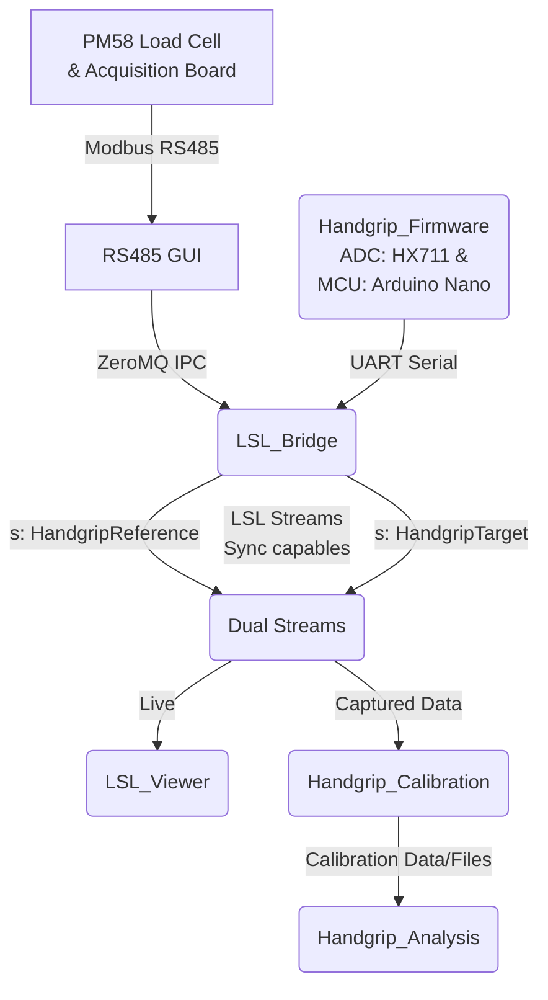

# Handgrip Suite

## Summary

- **Handgrip Suite** is the end-to-end repository for acquiring, visualizing, calibrating, and analyzing handgrip force data.
- The system combines a **target handgrip device** based on Arduino Nano + HX711/HX711-style load-cell acquisition with a **reference force chain** based on a PM58 load cell connected to a high-speed RS485 acquisition board.
- The host software stack is split into focused components: `RS485_GUI`, `LSL_Bridge`, `LSL_Viewer`, `Handgrip_Calibration`, and `Handgrip_Analysis`.
- The documentation is organized from **high-level operation** to **low-level implementation**: start here, then move to workflows, then component docs, then configuration and development references.
- This root README is intentionally short. The full documentation map starts at [`docs/index.md`](docs/index.md).

### System Architecture



```text
Physical force
  │
  ├── Target chain
  │     Handgrip sensor(s)
  │       → HX711 / Arduino Nano firmware
  │       → USB serial D2/M2 frames
  │       → LSL_Bridge
  │       → LSL stream: HandgripTarget
  │
  └── Reference chain
        PM58 load cell
          → high-speed acquisition board
          → RS485 / USB-RS485
          → RS485_GUI
          → ZeroMQ IPC topic: rs485.measurement.v1
          → LSL_Bridge
          → LSL stream: HandgripReference

HandgripTarget + HandgripReference
  → LSL_Viewer for live/replay inspection
  → Handgrip_Calibration for protocol recording, fitting, and reports
  → Handgrip_Analysis for offline signal characterization and filter design
```

### Modules

Following the system architecture, here are the entry points and purposes for each module:

- [PM58 Load Cell & Acquisition Board](docs/workflows/physical_setup.md): Physical sensing and wiring stack for the setup of the reference-force acquisition board. 
- [RS485_GUI](RS485_GUI/docs/index.md): GUI tool for connecting to the PM58 acquisition board via Modbus Active-Send mode over RS485. Provides streaming to the LSL_Bridge layer on real-time, along with live value monitoring. 
- [Handgrip_Firmware](Handgrip_Firmware/docs/index.md): Arduino Nano firmware that samples the Handgrip's HX711 load-cell data, timestamps frames, and emits calibration-ready telemetry over UART serial. 
- [LSL_Bridge](LSL_Bridge/docs/index.md): Middleware that ingests handgrip(target)/PM58(reference) sources and publishes synchronized Lab Streaming Layer streams (`HandgripTarget`, `HandgripReference`). 
- [LSL_Viewer](LSL_Viewer/docs/index.md): Real-time dashboard for synchronized real time stream monitoring, timing inspection, and XY correlation quality checks. 
- [Handgrip_Calibration](Handgrip_Calibration/docs/index.md): Calibration workflow that maps raw ADC counts into Newtons using reference-device ground truth. Evalautes multiple mathematical models to find the best fit, and returns report with model and exact parameters, with charts justification
- [Handgrip_Analysis](Handgrip_Analysis/docs/index.md): Frequency analysis for noise/drift/dynamics of the Handgrip's calibrated force signal. Evalulate an extensible set of predefined DSP filters, and returns exact filter parameters to be set on the LSL_Bridge filtered channel for production real-time streaming. 


## What to read when

| I want...                             | Start here                                                                                                   | Then read                                                                                                                                                                                                                                  |
| ------------------------------------- | ------------------------------------------------------------------------------------------------------------ | ------------------------------------------------------------------------------------------------------------------------------------------------------------------------------------------------------------------------------------------ |
| Understand what the whole suite does. | [`docs/start-here.md`](docs/start-here.md)                                                                   | [`docs/system-overview.md`](docs/system-overview.md), [`docs/workflows/handgrip-calibration.md`](docs/workflows/handgrip-calibration.md), [`docs/workflows/handgrip-analysis.md`](docs/workflows/handgrip-analysis.md)                     |
| See what to connect physically        | [`docs/workflows/physical-setup.md`](docs/workflows/physical-setup.md)                                       | [`docs/workflows/firmware-setup.md`](docs/workflows/firmware-setup.md), [`docs/workflows/full-live-viewer-quickstart.md`](docs/workflows/full-live-viewer-quickstart.md), [`docs/troubleshooting/index.md`](docs/troubleshooting/index.md) |
| Understand repo structure             | [`docs/development/python-project-structure-primer.md`](docs/development/python-project-structure-primer.md) | Component docs under `*/docs/index.md`, [`docs/architecture/repository-layout.md`](docs/architecture/repository-layout.md), [`docs/configuration/index.md`](docs/configuration/index.md)                                                   |
| Load the Handgrip Firmware            | [`Handgrip_Firmware/README.md`](Handgrip_Firmware/README.md)                                                 | [`Handgrip_Firmware/docs/index.md`](Handgrip_Firmware/docs/index.md), [`docs/workflows/firmware-setup.md`](docs/workflows/firmware-setup.md)                                                                                               |
| Calibrate the Handgrip                | [`Handgrip_Calibration/docs/index.md`](Handgrip_Calibration/docs/index.md)                                   | [`Handgrip_Analysis/docs/index.md`](Handgrip_Analysis/docs/index.md), [`docs/workflows/handgrip-calibration.md`](docs/workflows/handgrip-calibration.md), [`docs/workflows/handgrip-analysis.md`](docs/workflows/handgrip-analysis.md)     |
| Extend the features                   | [`docs/system-overview.md`](docs/system-overview.md)                                                         | [`docs/architecture/index.md`](docs/architecture/index.md), [`docs/hardware/index.md`](docs/hardware/index.md), [`docs/archive/index.md`](docs/archive/index.md)                                                                           |


## Fastest safe quickstart

> **Status:** These are navigation-level commands. Use the linked workflow docs for the validated step-by-step procedure, expected outputs, and failure branches.

From the repository root:

```bash
uv sync
```

Then run the live system in this order:

```bash
# Terminal 1 — reference acquisition board GUI / IPC publisher
uv run rs485-gui

# Terminal 2 — target/reference bridge to Lab Streaming Layer
uv run lsl-bridge

# Terminal 3 — live viewer
uv run lsl-viewer
```

Expected high-level result:

- `RS485_GUI` receives reference-board data and publishes IPC messages.
- `LSL_Bridge` publishes `HandgripTarget` and `HandgripReference` streams.
- `LSL_Viewer` opens a browser UI and displays target/reference plots.

For the full operational path, read [`docs/workflows/full-live-viewer-quickstart.md`](docs/workflows/full-live-viewer-quickstart.md).

## Main workflows

| Workflow                  | Purpose                                                                       | Document                                                                                         |
| ------------------------- | ----------------------------------------------------------------------------- | ------------------------------------------------------------------------------------------------ |
| Physical setup            | Connect PM58, handgrip, acquisition board, RS485, and host PC safely          | [`docs/workflows/physical-setup.md`](docs/workflows/physical-setup.md)                           |
| Firmware setup            | Build/upload Arduino Nano firmware and validate serial frames                 | [`docs/workflows/firmware-setup.md`](docs/workflows/firmware-setup.md)                           |
| Target-only quickstart    | Validate target firmware → bridge → `HandgripTarget` without reference chain  | [`docs/workflows/target-only-quickstart.md`](docs/workflows/target-only-quickstart.md)           |
| Reference-only quickstart | Validate acquisition board → RS485 GUI → IPC without target chain             | [`docs/workflows/reference-only-quickstart.md`](docs/workflows/reference-only-quickstart.md)     |
| Full live viewer          | Start RS485 GUI, LSL bridge, and viewer in the correct order                  | [`docs/workflows/full-live-viewer-quickstart.md`](docs/workflows/full-live-viewer-quickstart.md) |
| Handgrip calibration      | Record calibration sessions, fit models, generate reports, validate constants | [`docs/workflows/handgrip-calibration.md`](docs/workflows/handgrip-calibration.md)               |
| Handgrip analysis         | Run offline signal characterization and filter-design workflows               | [`docs/workflows/handgrip-analysis.md`](docs/workflows/handgrip-analysis.md)                     |

## Components

| Component              | Role                                                               | Entry point                                                        | Detailed docs                                                              |
| ---------------------- | ------------------------------------------------------------------ | ------------------------------------------------------------------ | -------------------------------------------------------------------------- |
| `Handgrip_Firmware`    | Arduino Nano + HX711 firmware for target handgrip serial data      | [`Handgrip_Firmware/README.md`](Handgrip_Firmware/README.md)       | [`Handgrip_Firmware/docs/index.md`](Handgrip_Firmware/docs/index.md)       |
| `RS485_GUI`            | Reference acquisition-board GUI, logging, and ZeroMQ IPC publisher | [`RS485_GUI/README.md`](RS485_GUI/README.md)                       | [`RS485_GUI/docs/index.md`](RS485_GUI/docs/index.md)                       |
| `LSL_Bridge`           | Publishes target/reference streams to Lab Streaming Layer          | [`LSL_Bridge/README.md`](LSL_Bridge/README.md)                     | [`LSL_Bridge/docs/index.md`](LSL_Bridge/docs/index.md)                     |
| `LSL_Viewer`           | Live/CSV/XDF visualization and XY correlation viewer               | [`LSL_Viewer/README.md`](LSL_Viewer/README.md)                     | [`LSL_Viewer/docs/index.md`](LSL_Viewer/docs/index.md)                     |
| `Handgrip_Calibration` | Calibration protocols, session recording, model fitting, reports   | [`Handgrip_Calibration/README.md`](Handgrip_Calibration/README.md) | [`Handgrip_Calibration/docs/index.md`](Handgrip_Calibration/docs/index.md) |
| `Handgrip_Analysis`    | Offline analysis stages and DSP/filter candidate evaluation        | [`Handgrip_Analysis/README.md`](Handgrip_Analysis/README.md)       | [`Handgrip_Analysis/docs/index.md`](Handgrip_Analysis/docs/index.md)       |

## Installation and validation

### Python workspace

Recommended from the repository root:

```bash
uv sync
uv run pytest
```

The root `pyproject.toml` installs the local Python components as editable packages:

- `rs485-gui`
- `lsl-bridge`
- `lsl-viewer`
- `handgrip-calibration`
- `handgrip-analysis`

### Firmware workspace

Firmware is built with PlatformIO from the root `platformio.ini`:

```bash
pio run -e nanoatmega328
pio run -e nanoatmega328 -t upload
pio device monitor -e nanoatmega328
```

Read [`docs/workflows/firmware-setup.md`](docs/workflows/firmware-setup.md) before uploading or changing firmware constants.

## Documentation map

Start at [`docs/index.md`](docs/index.md).

High-level navigation:

- [`docs/start-here.md`](docs/start-here.md) — friendly conceptual introduction.
- [`docs/system-overview.md`](docs/system-overview.md) — architecture without code internals.
- [`docs/workflows/`](docs/workflows/) — operator workflows.
- [`docs/hardware/`](docs/hardware/) — physical setup, PM58, acquisition board, references, photos.
- [`docs/configuration/`](docs/configuration/) — configuration references.
- [`docs/architecture/`](docs/architecture/) — dataflow, stream contracts, runtime processes.
- [`docs/development/`](docs/development/) — source-layout, extension, testing, maintenance.
- [`docs/troubleshooting/`](docs/troubleshooting/) — symptom-first troubleshooting.
- [`docs/examples/`](docs/examples/) — curated example outputs.
- [`docs/archive/`](docs/archive/) — historical/deprecated material.

