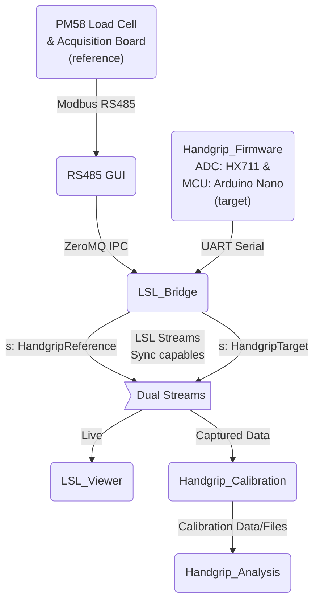

# Handgrip Suite

- [Handgrip Suite](#handgrip-suite)
  - [Summary](#summary)
    - [System Architecture](#system-architecture)
    - [Components](#components)
  - [Quickstart](#quickstart)
    - [What to read and when](#what-to-read-and-when)
  - [Main workflows available](#main-workflows-available)
  - [Installation and validation](#installation-and-validation)
    - [Python workspace](#python-workspace)
    - [Firmware workspace](#firmware-workspace)
  - [Documentation map](#documentation-map)


## Summary

- **Handgrip Suite** is the end-to-end repository for acquiring, visualizing, calibrating, and analyzing handgrip force data.
- The system combines a **target handgrip device** based on Arduino Nano + HX711 load-cell acquisition with a **reference force chain** based on a PM58 load cell connected to a high-speed RS485 acquisition board.
- The host software stack is split into focused components: `RS485_GUI`, `LSL_Bridge`, `LSL_Viewer`, `Handgrip_Calibration`, and `Handgrip_Analysis`.
- The documentation is organized from **high-level operation** to **low-level implementation**: start here, then move to workflows, then component docs, then configuration and development references.
- This root README is intentionally short. The full documentation map starts at [`docs/index.md`](docs/index.md).

### System Architecture



### Components

Following the system architecture, here are the entry points and purposes for each module:

- [PM58 Load Cell & Acquisition Board](docs/workflows/physical-setup.md): Physical sensing and wiring stack for the reference-force acquisition board. 
- [RS485_GUI](RS485_GUI/docs/index.md): GUI tool for connecting to the PM58 acquisition board and stream to the LSL_Bridge layer on real-time. 
- [Handgrip_Firmware](Handgrip_Firmware/docs/index.md): Firmware that samples the Handgrip's HX711 load-cell data ready telemetry over for UART serial. 
- [LSL_Bridge](LSL_Bridge/docs/index.md): Middleware that ingests both signals and publishes a synchronized Lab Streaming Layer streams (`HandgripTarget`, `HandgripReference`). 
- [LSL_Viewer](LSL_Viewer/docs/index.md): Real-time dashboard for synchronized real time stream monitoring.
- [Handgrip_Calibration](Handgrip_Calibration/docs/index.md): Calibration workflow that maps raw ADC counts into Newtons using reference-device ground truth. Evalautes multiple mathematical models to find the best fit, and returns report with model and exact parameters, with charts justification
- [Handgrip_Analysis](Handgrip_Analysis/docs/index.md): Frequency analysis for noise/drift/dynamics of the Handgrip's calibrated force signal. Evalulate an extensible set of predefined DSP filters, and returns exact filter parameters to be set on the LSL_Bridge filtered channel for production real-time streaming. 


## Quickstart

> **Status:** These are navigation-level commands. Use the linked workflow docs for the validated step-by-step procedure, expected outputs, and failure branches.

Install UV Python package manager from: 
- [https://docs.astral.sh/uv/getting-started/installation/](https://docs.astral.sh/uv/getting-started/installation/)

Then, run from the repository root:

```bash
uv venv .venv
source .venv/bin/activate
uv sync
```

Then run the live system in this order:

```bash
# Terminal 1 — reference acquisition board GUI / IPC publisher
uv run rs485-gui

# Terminal 2 — target/reference bridge to Lab Streaming Layer
uv run lsl-bridge

# Terminal 3 — live viewer
uv run lsl-viewer
```

Expected high-level result:

- `RS485_GUI` receives reference-board data and publishes IPC messages.
- `LSL_Bridge` publishes `HandgripTarget` and `HandgripReference` streams.
- `LSL_Viewer` opens a browser UI and displays target/reference plots.

For the full operational path, read [`docs/workflows/full-live-viewer-quickstart.md`](docs/workflows/full-live-viewer-quickstart.md).

### What to read and when

| I want to…                           | Start here                                                                                                   | Then read                                                                                                                                                                    |
| ------------------------------------ | ------------------------------------------------------------------------------------------------------------ | ---------------------------------------------------------------------------------------------------------------------------------------------------------------------------- |
| Understand what the whole suite does | [`docs/system-overview.md`](docs/system-overview.md)                                                         | [`docs/workflows/handgrip-calibration.md`](docs/workflows/handgrip-calibration.md), [`docs/workflows/handgrip-analysis.md`](docs/workflows/handgrip-analysis.md)             |
| Connect hardware                     | [`docs/workflows/physical-setup.md`](docs/workflows/physical-setup.md)                                       | [`Handgrip_Firmware/docs/workflow.md`](Handgrip_Firmware/docs/workflow.md), [`docs/workflows/full-live-viewer-quickstart.md`](docs/workflows/full-live-viewer-quickstart.md) |
| Understand repo structure            | [`docs/development/python-project-structure-primer.md`](docs/development/python-project-structure-primer.md) | Component `*/docs/index.md` files, [`docs/architecture/repository-layout.md`](docs/architecture/repository-layout.md)                                                        |
| Build/upload firmware                | [`Handgrip_Firmware/docs/workflow.md`](Handgrip_Firmware/docs/workflow.md)                                   | [`Handgrip_Firmware/docs/index.md`](Handgrip_Firmware/docs/index.md)                                                                                                         |
| Calibrate the handgrip               | [`docs/workflows/handgrip-calibration.md`](docs/workflows/handgrip-calibration.md)                           | [`Handgrip_Calibration/docs/workflow.md`](Handgrip_Calibration/docs/workflow.md)                                                                                             |
| Run signal analysis                  | [`docs/workflows/handgrip-analysis.md`](docs/workflows/handgrip-analysis.md)                                 | [`Handgrip_Analysis/docs/workflow.md`](Handgrip_Analysis/docs/workflow.md)                                                                                                   |
| Troubleshoot a problem               | [`docs/troubleshooting/index.md`](docs/troubleshooting/index.md)                                             | Component `*/docs/` troubleshooting links                                                                                                                                    |


---

## Main workflows available

| Workflow                  | Purpose                                                                       | Document                                                                                         |
| ------------------------- | ----------------------------------------------------------------------------- | ------------------------------------------------------------------------------------------------ |
| Physical setup            | Connect PM58, handgrip, acquisition board, RS485, and host PC safely          | [`docs/workflows/physical-setup.md`](docs/workflows/physical-setup.md)                           |
| Firmware setup            | Build/upload Arduino Nano firmware and validate serial frames                 | [`Handgrip_Firmware/docs/workflow.md`](Handgrip_Firmware/docs/workflow.md)                       |
| Target-only quickstart    | Validate target firmware → bridge → `HandgripTarget` without reference chain  | [`docs/workflows/target-only-quickstart.md`](docs/workflows/target-only-quickstart.md)           |
| Reference-only quickstart | Validate acquisition board → RS485 GUI → IPC without target chain             | [`docs/workflows/reference-only-quickstart.md`](docs/workflows/reference-only-quickstart.md)     |
| Full live viewer          | Start RS485 GUI, LSL bridge, and viewer in the correct order                  | [`docs/workflows/full-live-viewer-quickstart.md`](docs/workflows/full-live-viewer-quickstart.md) |
| Handgrip calibration      | Record calibration sessions, fit models, generate reports, validate constants | [`docs/workflows/handgrip-calibration.md`](docs/workflows/handgrip-calibration.md)               |
| Handgrip analysis         | Run target offline signal characterization and filter-design workflows        | [`docs/workflows/handgrip-analysis.md`](docs/workflows/handgrip-analysis.md)                     |


## Installation and validation

### Python workspace

Recommended from the repository root:

Install UV Python package manager from: 
- [`https://docs.astral.sh/uv/getting-started/installation/`](https://docs.astral.sh/uv/getting-started/installation/)

```bash
uv venv .venv
source .venv/bin/activate
uv sync
uv run pytest
```

The root `pyproject.toml` installs the local Python components as editable paon the Handgrip suiteckages:

- `rs485-gui`
- `lsl-bridge`
- `lsl-viewer`
- `handgrip-calibration`
- `handgrip-analysis`

### Firmware workspace

Firmware is built with PlatformIO from the root `platformio.ini`:

```bash
pio run -e nanoatmega328
pio run -e nanoatmega328 -t upload
pio device monitor -e nanoatmega328
```

Read [`Handgrip_Firmware/docs/workflow.md`](Handgrip_Firmware/docs/workflow.md) before uploading or changing firmware constants.

## Documentation map

Start at [`docs/index.md`](docs/index.md).

- [`docs/system-overview.md`](docs/system-overview.md) — what the suite does, physical chains, dataflow, start order.
- [`docs/workflows/`](docs/workflows/) — operator workflows.
- [`docs/hardware/`](docs/hardware/) — physical setup, PM58, acquisition board, references.
- [`docs/configuration/`](docs/configuration/) — configuration reference map.
- [`docs/architecture/`](docs/architecture/) — dataflow, stream contracts, runtime processes.
- [`docs/development/`](docs/development/) — source layout, extension, testing.
- [`docs/troubleshooting/`](docs/troubleshooting/) — symptom-first debugging.

