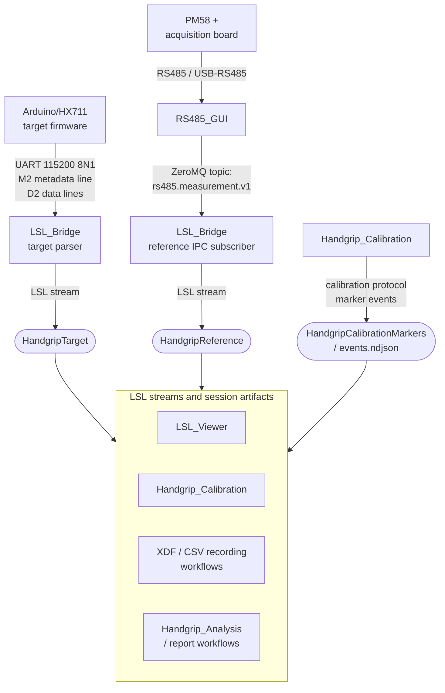

# Stream and Data Contracts

## Summary

- This document is the system-level **map** of cross-component data contracts in the Handgrip Suite.
- Each contract is owned and documented in full by the component that produces it; this page only shows who produces what and links down to the authoritative definition.
- The runtime boundary is `LSL_Bridge`, which converts firmware UART and RS485 GUI IPC into canonical Lab Streaming Layer (LSL) streams consumed by the viewer, calibration, and analysis workflows.

## Contract map



## Where each contract is defined

| Contract | Producer / owner | Canonical definition |
| -------- | ---------------- | -------------------- |
| Firmware UART frames (`M2` metadata, `D2` data) | `Handgrip_Firmware` | [Handgrip_Firmware/docs/serial-protocol.md](../../Handgrip_Firmware/docs/serial-protocol.md) |
| Acquisition modes behind the reference chain (Active-Send / Modbus RTU) | `RS485_GUI` | [RS485_GUI/docs/active-send-and-modbus.md](../../RS485_GUI/docs/active-send-and-modbus.md) |
| RS485 IPC payload (`rs485.measurement.v1`, `rs485.event.v1`) | `RS485_GUI` | [RS485_GUI/docs/ipc-schema.md](../../RS485_GUI/docs/ipc-schema.md) |
| LSL streams `HandgripTarget` / `HandgripReference` / `HandgripComponentEvents`, channel order, and CSV field order | `LSL_Bridge` | [LSL_Bridge/docs/stream-contracts.md](../../LSL_Bridge/docs/stream-contracts.md) |
| Timestamping / synchronization policy for the LSL streams | `LSL_Bridge` | [LSL_Bridge/docs/timestamping.md](../../LSL_Bridge/docs/timestamping.md) |
| `HandgripCalibrationMarkers` and session artifacts (`target.csv`, `reference.csv`, `events.ndjson`, configs, fit/report files) | `Handgrip_Calibration` | [Handgrip_Calibration/docs/recording.md](../../Handgrip_Calibration/docs/recording.md), [Handgrip_Calibration/docs/reports-and-outputs.md](../../Handgrip_Calibration/docs/reports-and-outputs.md) |
| Which captured fields analysis requires | `Handgrip_Analysis` | [Handgrip_Analysis/docs/workflow.md](../../Handgrip_Analysis/docs/workflow.md) |

## Calibration-authoritative signal

Calibration fits reference force against the raw target count, not firmware-scaled values:

```text
reference_force_N = f(target_raw_count)
```

`target_raw_count` is the HX711 raw ADC count emitted before any firmware scale/offset, which is why it — not `target_current_units` or `target_filtered_units` — is authoritative. The rationale lives with the producers: [Handgrip_Firmware/docs/serial-protocol.md](../../Handgrip_Firmware/docs/serial-protocol.md) and [LSL_Bridge/docs/stream-contracts.md](../../LSL_Bridge/docs/stream-contracts.md).

## Data ownership boundaries

| Contract area | Owner | System invariant |
| ------------- | ----- | ---------------- |
| Firmware serial schema | `Handgrip_Firmware` | Must emit the current `M2`/`D2` schema. |
| Reference acquisition IPC | `RS485_GUI` | Must publish normalized reference measurements on `rs485.measurement.v1`. |
| Target LSL stream | `LSL_Bridge` | Must expose target raw count and timing metadata. |
| Reference LSL stream | `LSL_Bridge` | Must expose reference force suitable for calibration. |
| Calibration markers / artifacts | `Handgrip_Calibration` | Must preserve protocol boundaries and session inputs for fitting and validation. |
| Viewer rendering | `LSL_Viewer` | Must consume contracts; display settings must not redefine data semantics. |
| Analysis inputs | `Handgrip_Analysis` | Must document which captured fields are required. |

## Change-control rule

Any change to a stream name, channel name or order, firmware frame field, IPC topic/field, reference-force semantic field, calibration-authoritative signal, or consumed session artifact is a cross-component migration. The owning component doc (linked above) lists the exact code, config, and tests that must change together — update this map at the same time.

## End-to-end validation

To confirm all contracts line up at runtime, follow [docs/workflows/full-live-viewer-quickstart.md](../workflows/full-live-viewer-quickstart.md) and the calibration preflight in [Handgrip_Calibration/docs/workflow.md](../../Handgrip_Calibration/docs/workflow.md).
