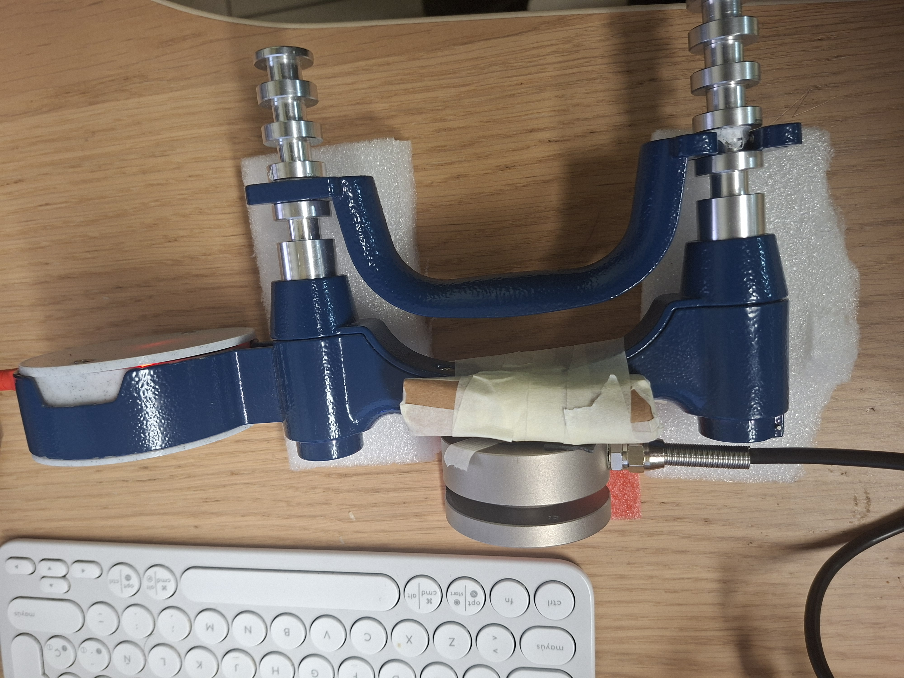
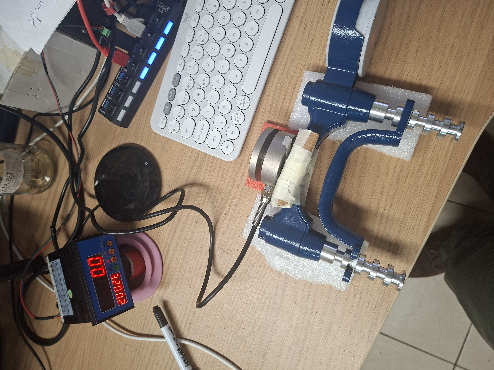
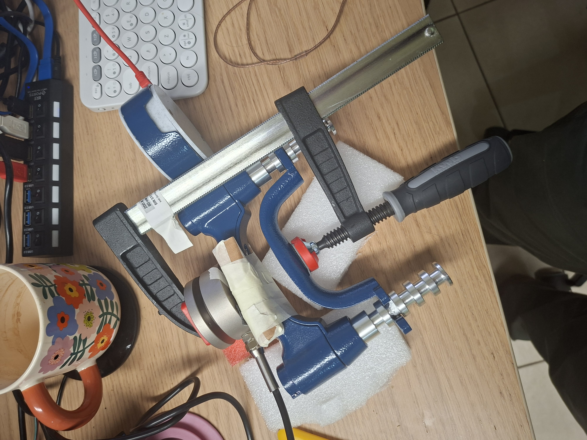

# PM58 + Handgrip Force Application Fixture

## Summary

This document explains the mechanical force path used to calibrate the Handgrip target against the PM58 reference load cell and the acquisition board.

The fixture has three documentation stages:

1. **PM58 in series with handgrip** — proves the reference sensor and the target device are mechanically in the same force path.
2. **PM58 + handgrip connected to acquisition board** — proves the mechanical path is connected to the electrical reference chain.
3. **Screw press controlled-force setup** — proves the system can apply repeatable controlled force for static holds, calibration, and verification.

Use this document before executing Handgrip calibration. Use [docs/hardware/pm58-wiring-and-bringup.md](pm58-wiring-and-bringup.md) for electrical wiring and [docs/hardware/acquisition-board-reference.md](acquisition-board-reference.md) for acquisition-board menus.

## Safety and mechanical assumptions

### Known assumptions

- The PM58 is the **reference force sensor**.
- The handgrip target is the **device under calibration**.
- The useful calibration force is the force transmitted through the shared mechanical chain, not merely the force applied somewhere near the fixture.
- The screw press is used to make force application slower, more repeatable, and less operator-dependent than free-hand squeezing.

### Required mechanical safety rules

- Keep fingers clear of the screw press and moving contact surfaces.
- Do not exceed the safe force range of the handgrip target, PM58 load cell, fixture hardware, or acquisition board configuration.
- Increase force slowly during first validation; do not jump directly to high loads.
- Stop if the force path visibly bends, slips, rotates, tilts, or unloads one sensor relative to the other.
- Treat any slipping or non-repeatable contact as a failed fixture validation, not as a software/calibration issue.

### Calibration assumption that must be true

The PM58 and handgrip must experience the same axial force with minimal off-axis loading, backlash, compliance, or frictional bypass. If this is not true, the calibration fit may look numerically clean while being mechanically invalid.

## Fixture stages

### Stage 1 — PM58 in series with handgrip

**Image file:** `docs/hardware/assets/pm58_n_handgrip_setup.jpg`

**Purpose:** Show that the PM58 reference sensor and the handgrip target are mechanically arranged in series.

**What to verify from the image:**

- The applied force path passes through both the PM58 and the handgrip target.
- The sensors are not side-loaded or bypassed by another mechanical support.
- The contact surfaces are aligned enough that force is primarily axial.
- The handgrip target is not loose, tilted, or under asymmetric preload.

**TODO if image is missing:** Add the photo named exactly `pm58_n_handgrip_setup.jpg` under `docs/hardware/assets/`.

### Stage 2 — PM58 + handgrip connected to acquisition board

**Image file:** `docs/hardware/assets/acq_board_n_pm58_n_handgrip_setup.jpg`

**Purpose:** Show the same mechanical series chain with the PM58 electrically connected to the acquisition board.

**What to verify from the image:**

- PM58 wires route to the acquisition board sensor terminal block.
- Sensor wiring does not cross or strain the moving force path.
- AC power and sensor wiring are physically separated as much as practical.
- RS485 wiring has enough slack and does not mechanically pull the board or sensor.

**TODO if image is missing:** Add the photo named exactly `acq_board_n_pm58_n_handgrip_setup.jpg` under `docs/hardware/assets/`.

### Stage 3 — Screw press controlled-force setup

**Image file:** `docs/hardware/assets/force_application_setup.jpg`

**Purpose:** Show the controlled-force fixture used to apply repeatable loads through the PM58 + handgrip chain.

**What to verify from the image:**

- The screw press applies force along the same axis as the PM58 + handgrip chain.
- The contact point is stable and does not slide during loading.
- The fixture base is rigid enough that applied displacement mostly becomes sensor force, not frame deformation.
- There is enough clearance to operate the setup without touching live wiring or moving contact points.

**TODO if image is missing:** Add the photo named exactly `force_application_setup.jpg` under `docs/hardware/assets/`.

## What each image proves

| Image                                   | Proves                                                                                      | Does not prove                                                                   |
| --------------------------------------- | ------------------------------------------------------------------------------------------- | -------------------------------------------------------------------------------- |
| `pm58_n_handgrip_setup.jpg`             | PM58 and handgrip target can be placed in a common mechanical chain.                        | That the force path is perfectly axial, backlash-free, or calibrated.            |
| `acq_board_n_pm58_n_handgrip_setup.jpg` | The reference sensor can be electrically connected while installed in the mechanical setup. | That RS485 communication, scaling, or acquisition-board settings are correct.    |
| `force_application_setup.jpg`           | The fixture can apply controlled force through the sensor chain.                            | That the force is traceable, linear, or free from friction/compliance artifacts. |

## How to validate force path before calibration

### Step 1 — Visual alignment check

- Confirm the screw press, PM58, and handgrip load path are collinear enough for first-order calibration.
- Confirm the handgrip target cannot rotate or slip during loading.
- Confirm cables do not add mechanical force or restrict motion.

**Pass condition:** The fixture remains aligned and mechanically stable through small preload changes.

### Step 2 — Reference live-response check

- Power the acquisition board.
- Zero the PM58 reference path with no applied force.
- Apply a small force with the screw press.
- Release the force.

**Pass condition:** The reference reading increases with applied force and returns near the previous baseline after release.

### Step 3 — Target live-response check

- Start the target firmware stream through the normal acquisition path.
- Apply the same small screw-press force.
- Release the force.

**Pass condition:** The target signal changes in the same loading direction and returns near baseline after release.

### Step 4 — Cross-signal monotonicity check

- Apply 3-5 increasing force levels slowly.
- At each level, hold long enough for both reference and target traces to be visually stable.
- Confirm both signals increase monotonically.

**Pass condition:** Higher screw-press displacement produces higher PM58 reference readings and higher target readings.

### Step 5 — Release and hysteresis smoke check

- Apply a moderate force.
- Release back to zero.
- Repeat at least three times.

**Pass condition:** Baseline return is repeatable enough for calibration. Small drift can be documented; large non-return suggests mechanical settling, slipping, or sensor preload problems.

## Common mistakes

| Mistake                                              | Symptom                                                                        | Fix                                                                   |
| ---------------------------------------------------- | ------------------------------------------------------------------------------ | --------------------------------------------------------------------- |
| PM58 and handgrip are not truly in series            | Reference changes but target does not, or target changes with poor correlation | Rebuild fixture so the same force path crosses both devices.          |
| Screw press applies off-axis force                   | Signal is noisy, nonlinear, or changes after touching the fixture              | Re-align contact surfaces and add guides/supports if needed.          |
| Fixture slips during holds                           | Calibration staircase has sudden jumps or inconsistent repeats                 | Add mechanical stops, improve clamping, or reduce maximum test force. |
| Cables mechanically load the sensor                  | Baseline changes when cables move                                              | Add strain relief and route cables away from the moving force path.   |
| Hidden preload before zero                           | Zero point changes after first load cycle                                      | Perform preload cycles, release, then zero before calibration.        |
| Trying to debug software before validating mechanics | Signals look inconsistent even though code is working                          | Complete the mechanical validation gates first.                       |

## Pre-calibration checklist

- [ ] All required fixture photos are committed under `docs/hardware/assets/`.
- [ ] PM58 and handgrip are mechanically in series.
- [ ] PM58 wiring has passed the bring-up checklist in [docs/hardware/pm58-wiring-and-bringup.md](pm58-wiring-and-bringup.md).
- [ ] Screw press applies force without slipping or visible off-axis deformation.
- [ ] Reference signal responds monotonically to force.
- [ ] Target signal responds monotonically to force.
- [ ] Both signals return near baseline after release.
- [ ] Any observed drift, hysteresis, or mechanical settling is documented before calibration.
