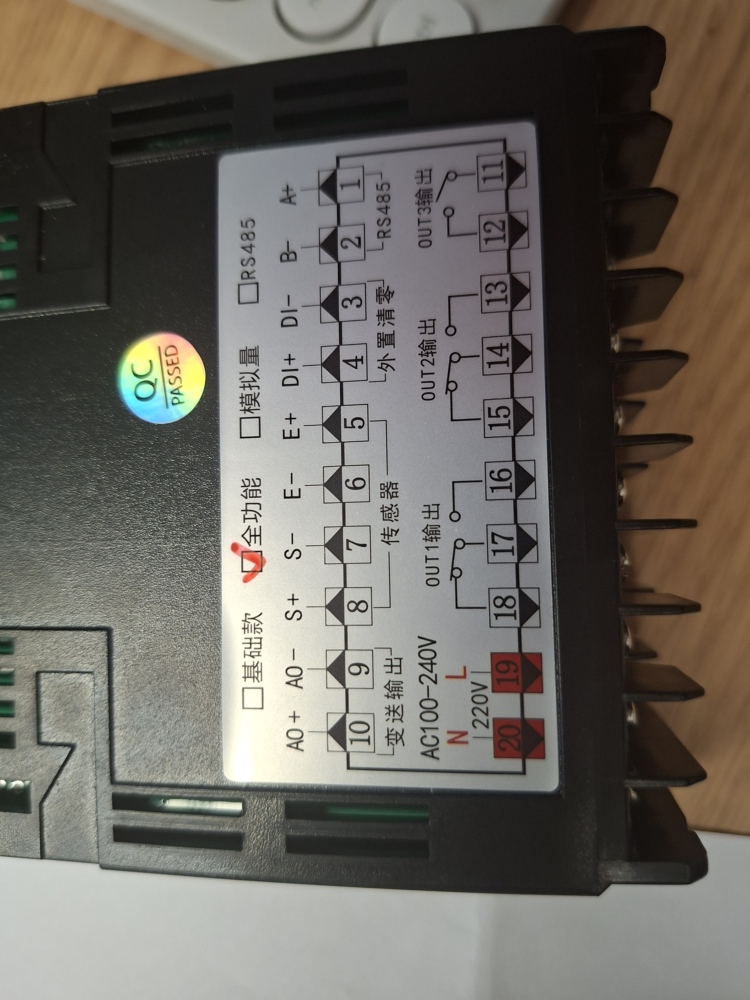
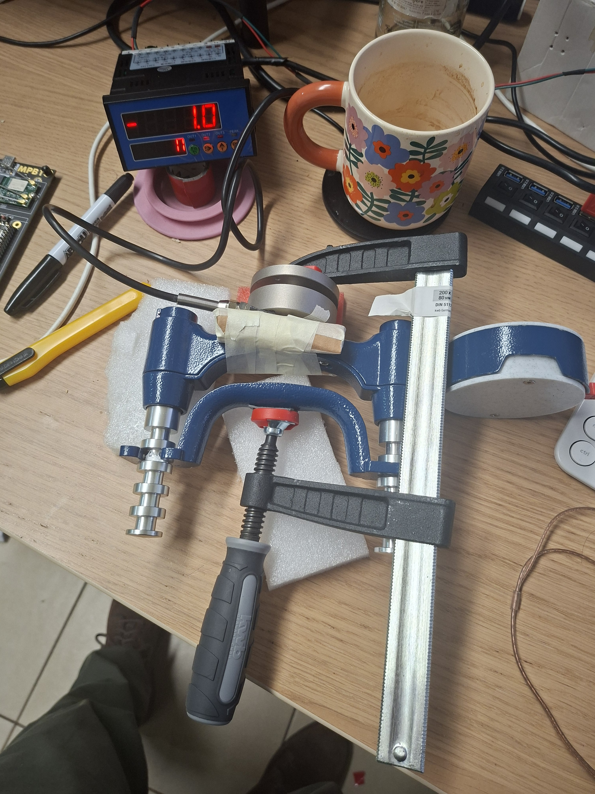
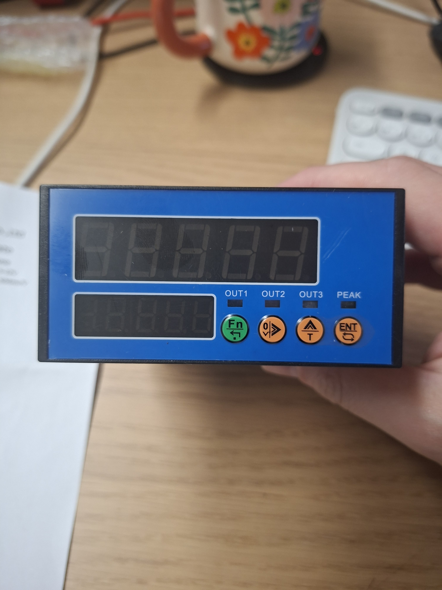
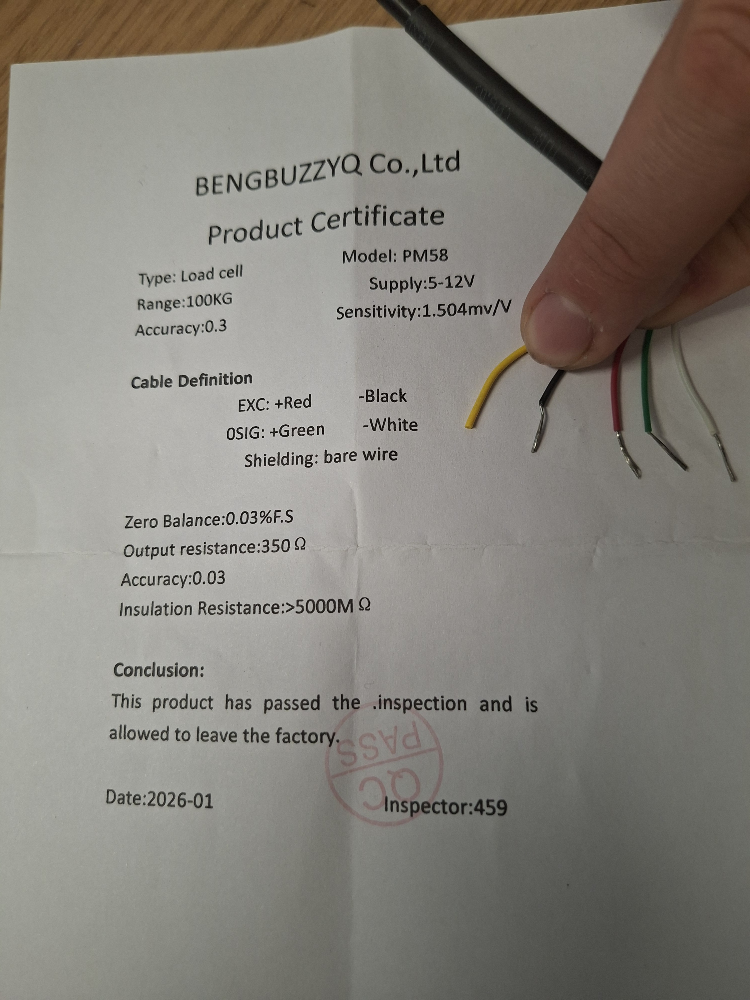

# Hardware Documentation

## Summary

This folder contains canonical hardware setup, reference, and fixture documentation.

## Visual navigation

| Area | Open this first | Visual reference |
| --- | --- | --- |
| PM58 wiring and acquisition-board bring-up | [docs/hardware/pm58-wiring-and-bringup.md](pm58-wiring-and-bringup.md) |  Use this to locate `1=A+`, `2=B-`, `5=E+`, `6=E-`, `7=S-`, `8=S+`, `19=L`, `20=N`. |
| Mechanical force fixture | [docs/hardware/force-fixture.md](force-fixture.md) |  Use this to validate force-path layout and cable routing before calibration. |
| Acquisition-board menus and reference settings | [docs/hardware/acquisition-board-reference.md](acquisition-board-reference.md) |  Use this while navigating board menus and validating display behavior. |
| Dual-device calibration configuration | [docs/hardware/dual-device-calibration-configuration.md](dual-device-calibration-configuration.md) |  Use this as the PM58 identity and wire-color cross-check. |

## Documents

| Document                                                                 | Purpose                                                                           |
| ------------------------------------------------------------------------ | --------------------------------------------------------------------------------- |
| [docs/hardware/pm58-wiring-and-bringup.md](pm58-wiring-and-bringup.md)   | PM58 load-cell wiring, acquisition-board bring-up, and reference-chain validation |
| [docs/hardware/acquisition-board-reference.md](acquisition-board-reference.md) | Full acquisition-board manual and recommended calibration configuration           |
| [docs/hardware/force-fixture.md](force-fixture.md)                       | PM58 + handgrip + screw-press controlled-force fixture                            |
| [docs/hardware/dual-device-calibration-configuration.md](dual-device-calibration-configuration.md) | Recommended reference-board + HX711 target calibration configuration              |
| [docs/hardware/assets/README.md](assets/README.md)                       | Hardware image asset map                                                          |
| [docs/hardware/references/README.md](references/README.md)               | Local PDF reference map                                                           |

## Reference materials

Source PDFs and vendor references:

| Reference | Local path |
| --- | --- |
| Acquisition-board original manual | [references/acquisition-board/acquisition-board-instruction-manual-original-v3.pdf](references/acquisition-board/acquisition-board-instruction-manual-original-v3.pdf) |
| Acquisition-board machine-translated English manual | [references/acquisition-board/acquisition-board-instruction-manual-machine-translated-en-v3.pdf](references/acquisition-board/acquisition-board-instruction-manual-machine-translated-en-v3.pdf) |
| Acquisition-board provider offer capture | [references/acquisition-board/acquisition-board-provider-offer-screencapture-2026-04-08.pdf](references/acquisition-board/acquisition-board-provider-offer-screencapture-2026-04-08.pdf) |
| HX711 datasheet | [references/hx711/hx711-datasheet-english.pdf](references/hx711/hx711-datasheet-english.pdf) |
